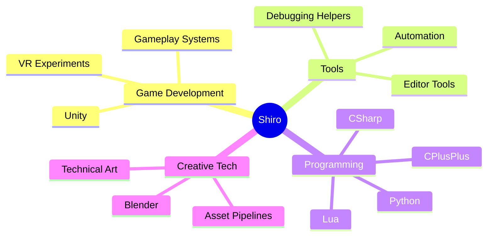

<p align="center">
  
</p>

<p align="center">
  <a href="#-about-me">About</a> •
  <a href="#-tech-stack">Tech Stack</a> •
  <a href="#-current-focus">Focus</a> •
  <a href="#-featured-projects">Projects</a> •
  <a href="#-github-stats">Stats</a> •
  <a href="#-contact">Contact</a>
</p>

<p></p>

<p align="center">
  
</p>

---

## 👋 About me

Hi, I'm **Shiro**.

I'm a developer who enjoys building clean systems, gameplay mechanics, tools, and interactive experiences.  
I mainly work with **Unity**, **Blender**, **C++**, **C#**, **Lua**, and **Python**.

```txt
> profile.status
Learning deeply, building carefully, improving constantly.
```

- 🎮 Interested in game development, tools, gameplay systems, VR, and technical experimentation.
- 🛠️ I like understanding how things work under the hood.
- 🧩 I enjoy solving technical problems and making systems cleaner.
- 🚀 Currently improving my portfolio and public projects.

---

## 🧰 Tech Stack

### Languages

<p>
  
</p>

### Engines, tools and workflow

<p>
  
</p>

### Things I like building

| Area | What I enjoy |
|---|---|
| 🎮 Game Dev | Gameplay systems, prototyping, tools, VR experiments |
| 🧠 Programming | Clean architecture, debugging, optimization, automation |
| 🧱 3D / Tools | Blender workflows, asset pipelines, technical art helpers |
| 🌐 Web / Apps | Interfaces, dashboards, utilities, API integrations |

---

## 🔭 Current Focus



---

## ⭐ Featured Projects

<table>
  <tr>
    <td width="50%">
      <h3 align="center">🎮 Project ENARIA</h3>
      <p align="center">
        <a href="https://github.com/CuteShirou/ENARIA">
          
        </a>
      </p>
      <p align="center">Create an Dofus like under Unity6.</p>
    </td>
    <td width="50%">
      <h3 align="center">🛠️ Revolution GameCard</h3>
      <p align="center">
        <a href="https://github.com/CuteShirou/RevolutionGameCard">
          
        </a>
      </p>
      <p align="center">Creating a card game, in the idea of the Double Twin in Evoland, in reference of the 'Triple Triad' from Final Fantasy VIII.</p>
    </td>
  </tr>
</table>

---

## 📊 GitHub Stats

<p align="center">
  
  
</p>

<p align="center">
  
</p>

---

## 🧪 Small terminal card

```bash
$ whoami
Shiro

$ main_stack
Unity Blender C# C++ Lua Python

$ interests
GameDev VR Tools Debugging Optimization

$ current_goal
Create things on Unity, for myself or for VRChat
```

---

## 📫 Contact

<p align="center">
  <a href="mailto:shiroytcontactpro@gmail.com">
    
  </a>
  <a href="https://www.linkedin.com/in/valentin-gonon-caetano-028271294/">
    
  </a>
  <a href="https://valentin.nexus-com.fr">
    
  </a>
</p>

---

<p align="center">
  
</p>

<p align="center">
  <i>Thanks for visiting my profile.</i>
</p>
